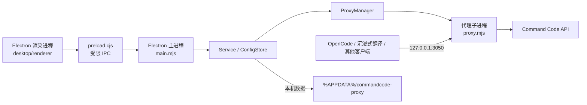

# 技术架构与模块边界

本文对应仓库 v1.0.27 的实现。维护前请以最新 `main` 源码和 `package.json` 为准；只改文档描述而未读实现，容易遗漏进程与配置边界。

## 进程和数据流

Electron 的渲染进程不能直接读写文件或启动子进程；`desktop/preload.cjs` 只公开约定的 `window.commandcode` IPC 方法。`desktop/main/main.mjs` 仅接受当前窗口主 frame 发起的 IPC，调用 `Service`、`ConfigStore` 等模块。实际 HTTP 代理是独立子进程，客户端直接访问它，**不经过渲染进程**。

### 启动、保存、退出

1. `main.mjs` 获取单实例锁，加载用户配置，创建 `Service`、IPC handler、主窗口与托盘。窗口先显示，页面加载完成后按 `autoStart` 设置启动代理，以减少安装完成后的启动等待。
2. `ConfigStore` 从 Electron `userData/config.json` 加载并验证配置；桌面版只允许 `127.0.0.1`、HTTPS 上游及 `user_` 格式密钥。写入采用临时文件后重命名；传给界面的常规状态只包含 `hasApiKey`，完整密钥仅通过专门的显隐/复制操作读取。
3. `Service.start()` 先检查端口占用，把 `proxy.mjs` 复制到 `userData/runtime/`，写入**不含 `apiKey`** 的运行配置，再交给 `ProxyManager` 启动。打包版使用自身 Electron 可执行文件配合 `ELECTRON_RUN_AS_NODE=1` 运行代理；源码开发版使用仓库的 `proxy.mjs`。
4. `ProxyManager` 管理自己启动的子进程、stdout/stderr、健康检查、启动状态及停止超时。启动后的 `/health` 探测成功才显示“代理已启用”。保存配置时，若代理正在运行，主进程会重启它。
5. 关闭窗口可按设置驻留托盘。真正退出应用时，先结束其管理的代理。登录自启和安装器最后一步启动由主进程与 `desktop/installer.nsh` 分别管理。

### HTTP 接入

默认监听 `127.0.0.1:3050`。客户端每次请求需提供自己的 CommandCode API Key（常用 `Authorization: Bearer <key>`）；桌面保存的密钥用于应用内模型读取、连接测试和测速，也可在界面中复制给客户端。

| 接口 | 用途 |
| --- | --- |
| `/health` | 本地代理存活检查 |
| `/v1/models` | 模型目录 |
| `/v1/chat/completions` | OpenAI Chat Completions；沉浸式翻译等客户端 |
| `/v1/responses` | OpenAI Responses |
| `/v1/messages` | Anthropic Messages |

OpenCode 一类接受 Base URL 的客户端填写 `http://127.0.0.1:3050/v1`。需要完整 Chat Completions 地址的客户端填写 `http://127.0.0.1:3050/v1/chat/completions`。用户改动监听端口后，地址中的端口也应随之改变。桌面只允许本机访问，跨电脑连接需要另行设计和评审。

## 源码职责表

| 文件/目录 | 负责什么；改动时注意什么 |
| --- | --- |
| `proxy.mjs` | 上游协议转换、认证、限流、流式响应及三类兼容接口；协议改动应配 `test/` 回归测试。 |
| `desktop/main/main.mjs` | Electron 生命周期、窗口/托盘、IPC 权限检查、系统操作、保存后重启。 |
| `desktop/main/config-store.mjs` | 默认配置、验证、用户数据持久化和密钥脱敏后的公开状态。 |
| `desktop/main/service.mjs` | 代理生命周期编排、本机 HTTP 请求、模型读取、连接测试、日志缓存与并发测速入口。 |
| `desktop/main/proxy-manager.mjs` | 子进程启动/停止、健康就绪判定和进程日志。 |
| `desktop/main/speed-test.mjs` | SSE 流解析，计算首个正文等待、总耗时和上游 token 用量推导的速度。 |
| `desktop/main/log-decoder.mjs` | 将 stdout/stderr 的字节片段还原成日志行和级别。 |
| `desktop/preload.cjs` | 受限 IPC 白名单；新增通道需同时审查主进程 handler。 |
| `desktop/renderer/index.html`、`styles.css` | 界面结构与视觉规则。 |
| `desktop/renderer/app.mjs`、`view.mjs` | 界面事件、状态轮询、页面切换、设置提交与状态渲染。 |
| `desktop/renderer/model-library.mjs`、`model-context-menu.mjs` | 模型选择、拖拽/滚轮/右键交互以及最多 3 个并发测速任务。 |
| `desktop/renderer/log-view.mjs`、`log-filter.mjs` | 日志文本稳定刷新和自定义筛选菜单的点击/键盘行为。 |
| `desktop/renderer/key-field.mjs`、`errors.mjs` | API Key 显隐与常见错误中文化。 |
| `desktop/assets/`、`desktop/installer.nsh` | 应用图标、界面素材、Windows 安装器定制。 |
| `desktop/smoke.mjs`、`desktop/smoke-fixtures.mjs` | 源码及打包版 Electron 端到端检查；默认模型响应由 IPC fixture 模拟。 |
| `desktop/test/`、`test/` | 桌面服务和代理协议单元/回归测试。 |
| `.github/workflows/ci.yml` | Windows 22 环境的依赖安装、测试、构建与产物上传。 |

## 配置、密钥与日志

开发版和安装版都通过 Electron 用户数据目录保存桌面设置，通常为 `%APPDATA%\commandcode-proxy\config.json`。`config.example.json` 是根目录命令行代理的空密钥示例，不是桌面程序自动读取的用户配置。不要把真实 `config.json` 提交或发给其他开发者。

`Service` 为桌面子进程设置 `HOST=127.0.0.1`、`CC_MAX_BODY_MB=16`、`CC_MAX_INFLIGHT=8` 和 `CC_SUPPRESS_VERSION_DRIFT_WARNING=1`。最后一项只抑制版本漂移提示，不能证明当前协议与未来上游完全兼容。`proxy.mjs` 从运行配置和环境读取上游地址等非密钥设置；请求中的 Bearer 密钥经代理转发到上游。

运行日志只保留最近 300 条，单条消息截断至 4000 字符。`Service.redact()` 对 `user_...` 形式密钥做替换；这不是对所有个人数据的通用脱敏。因此公开问题、CI 日志和截图仍需人工检查。`LogView` 在用户按住鼠标或选中文字时暂缓替换 `<pre>` 文本，避免框选被轮询打断。

## 界面交互约束

主界面不使用翻译专属措辞：导航含概览、代理设置、模型目录、运行日志、诊断与帮助。主进程返回状态，渲染进程约每 1.5 秒刷新。模型目录的可见选中状态由 `ModelLibrary` 集中管理；框选矩形用于命中计算但不显示蓝色覆盖框。选中多模型后，点击某模型切换它的状态，点击空白处清空。右键某模型只复制该模型 ID；在空白处右键复制当前选择序列最后的模型 ID。

日志级别筛选由 `log-filter.mjs` 管理一个按钮和一个带 `role=listbox` 的菜单。选项从“全部 / 错误 / 警告”选择，菜单用灰色选中态、支持方向键、Home/End、Enter、Esc 与点击外部关闭。筛选值通过按钮的 `value` 交给 `view.mjs`；修改 HTML 或筛选器时须同步检查 `desktop/smoke.mjs`。

API Key 输入框的圆点是界面遮罩，完整值只在用户点击眼睛后显示；清空保存代表移除密钥。不要把“已保存”说明或完整密钥硬编码回界面。

## 测试边界和构建物

`npm test` 检查代理协议，`npm run test:desktop` 检查桌面核心，`npm run test:ui` 检查真实窗口、代理启停、设置、日志选择、模型多选与测速控制。默认冒烟的模型列表/测速由 fixture 替代，既不需要真实密钥，也不证明真实上游模型可用。`--live` 才做真实上游连接验证。`--packaged` 检查 `dist/win-unpacked/CommandCode Proxy.exe`，不等于完整安装向导测试。

Electron Builder 根据 `package.json` 的 `build` 配置制作 NSIS 安装包。`desktop/main/**`、`desktop/renderer/**`、preload、assets、`LICENSE`、`NOTICE.md` 进入应用包，代理核心作为 `extraResources/proxy/proxy.mjs` 单独放置。安装包和依赖不在 Git 历史；分发时保留上游 MIT 与 Electron/Chromium 许可声明。授权来源及非官方身份见仓库根目录 `NOTICE.md`。
